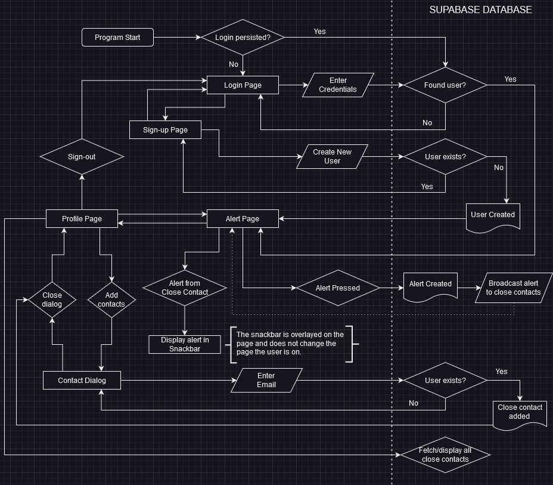
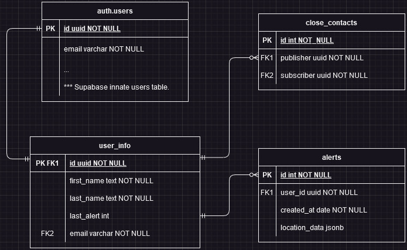

NIGHTSENTRY

Level of Achievement: Apollo 11

Motivation

Inspired by the recent rise in emphasis on personal security worldwide,
we felt such an app will bring about a significant marginal benefit to
users. While safety in Singapore is not that of a pressing issue, the
fact that this app can be used in any corner of the world (or as we
envision it to be) means that this app can still be put to great use.

Thus, the aim is to have NIGHTSENTRY be your virtual bodyguard that
empowers personal safety at your fingertips, especially at night. The
app will use a multi-pronged approach to achieve personal protection,
mainly covering elements of prevention and preparedness to response.

Scope

The Android App will eventually provide 2 key interfaces to help users
respond to threats -- Alerts and Newsfeed.

Alert System

Implemented:

\+ Allow users to specify close contacts on the Dashboard page via email
address. Users will have to accept or reject the requests accordingly
before they can receive alerts.

\+ Through the alerts page, users can send distress signals to their
close contacts. If they are active in the app, they will receive an
alert on their phone.

\- As an example: before leaving from home, a ward could register their
guardians as close contacts. When returning home, the ward notices that
someone is following them for an extended period of time.

\- If they click on the distress button to send distress signal to
emergency contacts, all the guardians would immediately receive this notice,
and unambiguously know that their ward is in danger.

To implement:

\- Alerts will be broadcasted via push notifications and contain
location data using Google Maps API. This will allow the contacts to
act upon this notice, instead of just knowing that they are in danger.

\- Should users opt in for it, these alerts will also be broadcast to
nearby users on the app.

Implement by early June:

Camera Function

\- When the app is activated, the phone camera will be turned on and
will record your surroundings, like a car camera recorder. These clips
will be stored in a database and will come in use should a malicious
case occur. Users can choose to delete the clips when they reach their
destination safely.

Implement by mid-late June:

Crime Alert Page

\- Through a user-maintained database, we hope to be able to inform
users of active crime alerts in the area, to warn users of previous
crimes that might have happened in the area.

\- For example, A user living in the neighbourhood could creates a
post to share about his/her experience last night about a sighting
of an arson seen nearby when he/she was on their way home.

\- A live map linked to the Google Maps API will show where the active
crime alerts are, and would also show where close contacts are sending
their distress signals from.

\- As a possible extension, we can scrape feeds of official government
websites such as SPF to look at current and past active crimes in the
area.

\- Through this, we hope that people who peruse the posts by other users
can note down locations to avoid while on route to an unfamiliar area.

Flowchart

The Database we are using is hosted by supabase, comprising of 3 tables,
not including the users table given by
supabase.

